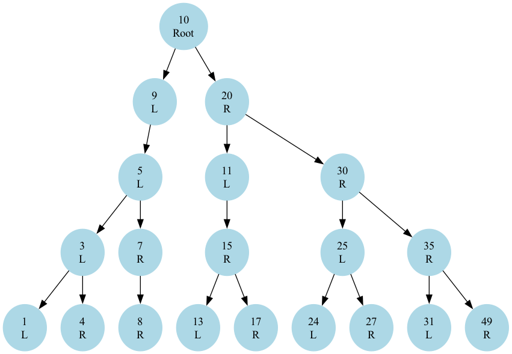

## Binary tree visualization
A simple program that creates a binary tree and provides a visualization of the tree. The values of the nodes can be directly edited in the `binary_tree.py` file.

## Requirements
- `graphviz` for visualization
